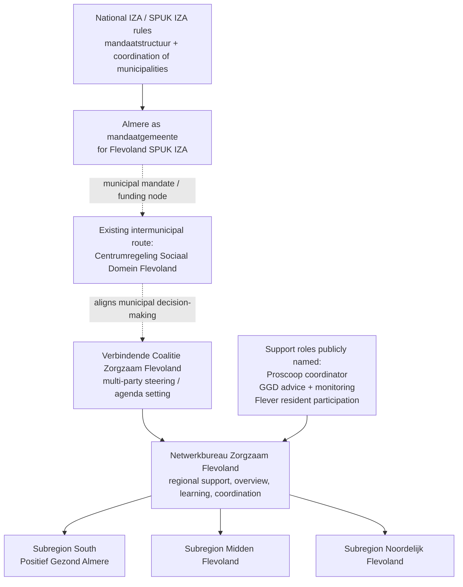

# Flevoland IZA and AZWA governance around Almere

## Executive summary

Yes. A stable public source set exists for the regional IZA governance picture around entity["city","Almere","Flevoland, Netherlands"] and entity["place","Flevoland","province in the Netherlands"]. The strongest public reading is that a **regional coordinating structure does exist**, but it appears to be a **network-based governance arrangement** rather than a separately incorporated public body. The recurring public elements are:

- a **bestuurlijke Verbindende Coalitie** that steers regional IZA priorities;
- a small **regional Netwerkbureau** that supports overview, coherence, learning and coordination;
- **subregional execution** in three subregions, with urlPositief Gezond Almereturn38search7 as the southern subregional example. citeturn12view0turn27view1turn22view0turn40view1

Public evidence also supports that **Almere is the municipal “mandaatgemeente” for the Flevoland IZA SPUK route**. National official financing annexes list “Flevoland – Almere” as mandaatgemeente, and the DUS-I SPUK IZA page explicitly says the subsidy covers a **mandate structure** and **coordination of municipalities**. That supports Almere as the municipal coordination and funding node on the municipalities’ side. It does **not** by itself prove that Almere is the sole regional owner of the wider coalition or that the regional structure acts independently of the municipalities. citeturn23view0turn22view2turn22view6

The clearest answer to the user’s core question is therefore:

- **Public evidence suggests there is a regional coordinating layer separate from any single municipality in functional terms**: the Verbindende Coalitie plus Netwerkbureau.
- **Public evidence does not show a distinct legal entity or autonomous public-law body created specifically for IZA/AZWA in Flevoland.**
- **Almere appears publicly as the mandate municipality, budget/penholder on some lines, and responsible organisation for at least one governance-strengthening project, but formal sole ownership or exclusive mandate is not settled by public evidence alone.** citeturn40view1turn36view1turn44view0

Two important limits remain. First, some of the most specific governance attachments, including the “Invulling Netwerkbureau” and “Rolomschrijving bestuurlijk aanspreekpunt”, are publicly discoverable in metadata/snippets but were not stably fetchable during this research and at least one meeting page flags the attachment as closed/“besloten”. Second, the public region definition is not completely clean: the generic Zorgakkoorden region overview lists six Flevoland municipalities, while the Flevoland regioplan itself says **Zeewolde follows Noord-Veluwe because of existing collaboration**. That boundary issue needs local validation before it is normalised into the repository. citeturn41search7turn41search9turn22view5turn35view0

## Key wording and conservative interpretation

The most useful public wording is very direct.

The official Flevoland regioplan says the region is working “aan de inrichting van een duurzaam netwerk” and still needs to make agreements about “(netwerk)leiderschap, regie en verantwoordelijkheden”. That is strong evidence of a **designed network governance model**, but it also shows that governance was still being worked out rather than fully fixed in the public 2023 plan. citeturn27view1

The official Noordoostpolder memo then moves that picture forward. It states that the Verbindende Coalitie consists of bestuurders from care, welfare, hospitals, GPs, patient representation, Zilveren Kruis and municipalities, and that “vanuit de Verbindende Coalitie” steering takes place. The same memo also says the “initiatief en de verantwoordelijkheid” for concrete action sits in the **subregions and existing decentralised collaborations**, while a “kleine ondersteuningsorganisatie op regionaal niveau” was created as the Netwerkbureau. That combination points to **regional steering + decentralised execution + small regional support office**. citeturn12view0

The Flevoland provincial note on the move “Van Zorgtafel naar Verbindende Coalitie Zorgzaam Flevoland” adds the clearest wording on why this happened: the old Zorgtafel was no longer enough, there was “behoefte aan een nieuwe governance structuur”, and “zorgverzekeraar en gemeenten trekken dit proces”. The same note says municipal decision-making is aligned through the **Centrumregeling Sociaal Domein**. That language strongly suggests that the regional coordination layer is **not independent of municipalities**, but is also **broader than a single municipality**. citeturn33search0

The 2025–2027 ZonMw governance-strengthening project is the cleanest current public summary. It says Flevoland chose a “lichte governance structuur”, that the “bestuurlijke Verbindende Coalitie” has its own development path, that the “ondersteunende Netwerkbureau” is being recalibrated, and that the responsible organisation for this project is **Gemeente Almere**. That combination is especially valuable for repository use because it ties together: light governance, coalition, support bureau, subregions, and Almere as a formal public penvoerder on this subsidy line. citeturn40view1

Operationally, the best named public coordinator role comes from partner pages rather than primary municipal decisions. Proscoop says it fulfils “de rol van coördinator” within the Netwerkbureau; Flever says it has the role of adviser on resident involvement in that bureau; and GGD Flevoland reports a “stevige adviesrol” for the bureau and monitoring work connected to Positief Gezond Almere. Those sources help map the support architecture, but they should not be upgraded into proof of formal ownership. citeturn10view7turn21view0turn32search15

## Evidence table

| Source | Publisher | Date | URL | What it proves | Relevance to regional governance / mandaatgemeente / coordination | Strength | Repository action |
| --- | --- | --- | --- | --- | --- | --- | --- |
| urlRegioplan IZA Flevoland Zorgzaam Flevoland 2023turn25view0 | urlZorgakkoorden.nl / IZA regio Flevolandturn24view0 | 2023; stable official public PDF | urlhttps://www.zorgakkoorden.nl/.wh/ea/uc/fd66c429f0102ab17b6008975a60227c69c40e0813df500/Regioplan_IZA_Flevoland.pdfturn25view0 | Says Flevoland is building a “duurzaam netwerk”; governance agreements on “(netwerk)leiderschap, regie en verantwoordelijkheden” were still to be made; the Verbindende Coalitie is the key steering forum; and Zeewolde follows Noord-Veluwe because of existing cooperation. citeturn27view1turn35view0turn27view3 | Core primary source for governance design, regional scope and the limit that formal roles were still being shaped. | strong | replace_weaker_source |
| urlMEMO aan Raad – Informeren over de ontwikkelingen van het Integraal Zorgakkoord in Flevolandturn12view0 | urlCollege van B&W Noordoostpolderturn12view0 | 2024-08-13; stable official public PDF | urlhttps://raad.noordoostpolder.nl/Documenten/D05-00-Memo-stand-van-zaken-Integraal-Zorgakkoord-2024.pdfturn12view0 | Says the Verbindende Coalitie consists of bestuurders from care, welfare, hospitals, GPs, patient representation, Zilveren Kruis and municipalities; that steering happens “vanuit de Verbindende Coalitie”; that initiative/responsibility lies in subregions and existing decentralised collaborations; and that a small regional Netwerkbureau is funded from regional SPUK IZA and Zilveren Kruis. citeturn12view0 | Best public operational description of the actual governance split between steering, support office and decentralised execution. | strong | add_source_candidate |
| urlMededeling m.b.t. Van Zorgtafel naar Verbindende Coalitie Zorgzaam Flevolandturn33search0 | urlProvincie Flevoland / Stateninformatie Flevolandturn33search0 | 2024-11-12; official public PDF metadata/snippet, but fetch unstable | urlhttps://stateninformatie.flevoland.nl/Documenten/DOCUVITP-3332275-v6-Mededeling-m-b-t-Van-Zorgtafel-naar-Verbindende-Coalitie-Zorgzaam-Flevoland.PDFturn33search0 | Says the old Zorgtafel was no longer sufficient; there was a need for a “nieuwe governance structuur”; municipalities and the insurer are the “aangewezen trekkers”; and municipal decision-making is aligned via the Centrumregeling Sociaal Domein. citeturn33search0 | Strongest public wording on why the new coordination structure exists and how it relates back to municipalities. | strong | add_source_candidate |
| urlDoorontwikkeling Zorgzaam Flevoland naar een toekomstbestendige samenwerkingsstructuurturn22view0 | urlZonMw project pageturn22view0 | 2025–2027 project page; stable official public page | urlhttps://projecten.zonmw.nl/nl/project/doorontwikkeling-zorgzaam-flevoland-naar-een-toekomstbestendige-samenwerkingsstructuurturn22view0 | Says Flevoland chose a “lichte governance structuur”; regional level is for overview, coherence and learning; the Verbindende Coalitie has its own development path; the Netwerkbureau is supporting; the structure works through three subregions; and the responsible organisation is Gemeente Almere. citeturn40view1 | High-value source for current governance model and for Almere’s formal penvoerder role on governance strengthening. | strong | add_source_candidate |
| urlZorgzaam Flevoland project pageturn22view1 | urlZonMw project pageturn22view1 | Undated public project page; stable | urlhttps://projecten.zonmw.nl/nl/project/zorgzaam-flevolandturn22view1 | Says the project focused on strengthening collaboration in three subregions and setting up a regional Netwerkbureau; subregion south is Positief Gezond Almere. citeturn40view0 | Useful bridge source between regional governance and Almere’s southern subregion. | medium | supports_existing_claim |
| urlSpecifieke uitkering IZA-doelen 2023-2026turn22view2 | urlDienst Uitvoering Subsidies aan Instellingenturn22view2 | Current official page; stable | urlhttps://www.dus-i.nl/subsidies/zorg-en-gezondheid/specifieke-uitkering-integraal-zorgakkoordturn22view2 | States that IZA SPUK activities include “het opstellen van een mandaatstructuur” and “de coördinatie van gemeenten”. citeturn22view2 | National canonical support for why a mandate municipality / coordination structure exists at all. | strong | add_source_candidate |
| urlBrief aan Parlement – Wijziging SPUK IZA en brede SPUK, bijlage 2Bturn23view0 | urlMinisterie van VWS document mirrored in public council systemturn23view0 | 2025; stable public PDF mirror of official letter annex | urlhttps://zwolle.bestuurlijkeinformatie.nl/Document/View/73c9ebe8-9347-42f0-9980-15a7f54cdca3turn23view0 | Lists “Flevoland – Almere” under “Regio / Mandaatgemeente”; also says AZWA funds are intended to ensure continuity of municipalities’ IZA investments. citeturn23view0 | Strong official evidence that Almere is the mandate municipality on the municipal financing side. | strong | replace_weaker_source |
| urlCentrumregeling Sociaal Domein Flevolandturn36view0 | urlLokale wet- en regelgeving / Overheid.nlturn36view1 | 2018–current; stable official regulation | urlhttps://lokaleregelgeving.overheid.nl/CVDR730330/1turn36view0 | Shows an existing intermunicipal mandate arrangement in which colleges can assign tasks and mandate powers to Almere; Overheid.nl lists the arrangement as current and includes the six municipalities. citeturn36view0turn36view1 | Strong contextual source for the municipal decision-alignment route mentioned by the province; not an IZA-specific governance source by itself. | strong | add_source_candidate |
| urlDrie 'vloten', één missie: Zorgzaam Flevolandturn41search5 | urlProscoopturn41search13 | 2024-12-11; stable public partner page | urlhttps://proscoop.nl/actueel/drie-vloten-een-missie-zorgzaam-flevoland/turn41search5 | Says the Netwerkbureau is the “vuurtoren” of Zorgzaam Flevoland and that Proscoop fulfils the role of coordinator within it. citeturn41search5turn10view7 | Good named-actor evidence for operational coordination; weaker than a council or governance decision. | medium | add_source_candidate |
| urlMeerjarenplan Fleverturn21view0 | urlFleverturn41search8 | 2025 PDF on official site; stable | urlhttps://flever.nl/wp-content/uploads/2025/04/Meerjarenplan-Flever-JvG5-DEF.pdfturn21view0 | Says Flever fulfils “de rol van adviseur inwonerbetrokkenheid in het Netwerkbureau van Zorgzaam Flevoland.” citeturn21view0 | Helpful for mapping Flever as support/advice actor, not as proven formal owner. | medium | add_source_candidate |
| urlBestuursrapportage januari 2024 t/m augustus 2024 GGD Flevolandturn32search15 | urlGGD Flevolandturn41search11 | 2024-11-07; stable official public PDF | urlhttps://www.ggdflevoland.nl/app/uploads/sites/6/2024/11/Agendabundel-AB-7-november-GGD-Flevoland.pdfturn32search15 | Says GGD Flevoland strengthened its regional monitoring task, has a “stevige adviesrol” at the Netwerkbureau, and has a bridge role in the knowledge network. citeturn32search15turn10view9 | Useful for the GGD role in coordination, monitoring and advice. | medium | add_source_candidate |
| urlOntwerpbegroting 2026 GGD Flevolandturn44view0 | urlGGD Flevolandturn41search11 | 2025-06-04; stable official public PDF | urlhttps://www.ggdflevoland.nl/app/uploads/sites/6/2025/06/3.1-2035954-GGD-Flevo-Ontwerpbegroting-2026.pdfturn44view0 | Shows budget lines under Almere for “Monitoring netwerkbureau”, “Netwerksecretaris/netwerkbureau Zorgzaam Flevoland”, and “Positieve Gezondheid Almere monitoring (zorgverzekeraar)”. citeturn44view0 | Strong budget-context evidence that Almere-linked lines fund regional coordination and monitoring functions; not proof of ownership or full budget split. | medium | add_source_candidate |
| urlKadernota 2027 GGD Flevolandturn44view1 | urlGGD Flevolandturn41search11 | 2026-01-21; stable official public PDF | urlhttps://www.ggdflevoland.nl/app/uploads/sites/6/2026/01/3.1-Kadernota-2027-GGD-Flevoland.pdfturn44view1 | Says GGDs must still be “formeel erkend” by municipalities, insurers and others to fulfil a coordinating role in regional prevention infrastructure; also says SPUK/GALA is ending and AZWA allocation is not yet known. citeturn44view1 | Very useful limiting source: it shows public evidence of aspiration/need, not yet a complete mandate settlement. | medium | contradicts_or_limits_existing_claim |
| urlVacature Regiocoördinator Integraal Zorgakkoordturn18view0 | url8baan.nl mirror of Gemeente Almere vacancyturn18view0 | “1 year ago”; secondary mirror only | urlhttps://www.8baan.nl/vacature/regiocoordinator-integraal-zorgakkoord/turn18view0 | Suggests Gemeente Almere recruited a regional IZA coordinator dealing with five municipalities, budget tracking, the IZA workgroup and trekkersoverleg. citeturn43search0 | Useful orientation on job design, but not a strong authority source because the official vacancy archive was not found. | weak | orientation_only |

## Governance diagram

The diagram below shows the **most conservative structure that public evidence currently supports**. Dashed relationships indicate interpretation that still needs local validation.

Public sources indicate a national SPUK/mandate layer, a municipal mandate route through Almere, a multi-party regional coalition, and a small support bureau, with execution pushed toward subregions and existing collaborations. They do **not** publicly prove a separate legal entity for the coalition or bureau. citeturn22view2turn23view0turn36view1turn12view0turn40view1turn10view7

## Candidate repository updates

The following sources are the best candidates to ingest into the repository’s public-source corpus if they are not already present.

**Ingest now**

The strongest intake set is the official Flevoland regioplan, the Noordoostpolder IZA status memo, the ZonMw 2025–2027 governance project page, the DUS-I SPUK IZA page, the official VWS SPUK/AZWA annex showing “Flevoland – Almere” as mandaatgemeente, and the Overheid.nl Centrumregeling entry. Together, these sources materially reduce ambiguity about: the existence of a regional coalition, the support bureau model, Almere’s mandate-municipality role, and the fact that governance is organised as a light network rather than a separately evidenced public authority. citeturn25view0turn12view0turn40view1turn22view2turn23view0turn36view1

For actor mapping, the best second-wave intake set is the Proscoop article, the Flever meerjarenplan, the GGD bestuursrapportage, the GGD ontwerpbegroting 2026 and the GGD kadernota 2027. These sources are especially useful for the repository rows on **PGA / Zorgzaam / Flever interface**, **GGD Flevoland coordination**, **monitoring / dashboards**, **digital and operational infrastructure**, and **funding context**. They should, however, be tagged as **role/context evidence** rather than owner/mandate evidence. citeturn41search5turn21view0turn32search15turn44view0turn44view1

**Defer**

The attachment pages for **“Invulling Netwerkbureau Zorgzaam Flevoland”** and **“Rolomschrijving bestuurlijk aanspreekpunt en deelnemer agendaoverleg IZA Zorgzaam Flevoland”** are promising, but they were not stably retrievable during this research and one council page labels the relevant attachment as closed/“besloten”. They are good leads for targeted capture, but not yet good canonical intake objects. If a stable public copy can be obtained, these may become among the strongest governance sources in the corpus. citeturn41search0turn41search1turn41search9

**Do not ingest as authority evidence**

The mirrored vacancy for **Regiocoördinator Integraal Zorgakkoord** is useful as an orientation signal, especially because it suggests a chairing role in the werkgroep IZA and trekkersoverleg. But it is not an official archived municipal source, so it should not be used as primary proof of reporting lines, mandate or ownership. Keep it only as a lead for stakeholder validation if needed. citeturn43search0

A specific repository-quality point should be logged immediately: the regional scope should not be normalised without qualification. The Zorgakkoorden landing page lists six Flevoland municipalities, but the Flevoland regioplan itself says Zeewolde follows Noord-Veluwe. That mismatch should be handled as a **scope-note or split-note**, not silently flattened. citeturn22view5turn35view0turn34search1

## Remaining uncertainties and recommended stakeholder questions

Several questions still require stakeholder, legal or finance validation.

Public research did **not** establish the legal form of urlZorgzaam Flevolandturn20view0 or the Netwerkbureau. The public sources consistently call them a coalition, structure, network, platform or bureau, but I did not find a public source proving a dedicated stichting, vereniging, GR, BV or other separate juridical form. If the repository currently implies that such a legal form exists, that implication is too strong. citeturn33search0turn40view1turn12view0

Public research also did **not** settle the formal reporting line of the regional coordinator / Netwerkbureau. The strongest official public trail points to a “bestuurlijk aanspreekpunt”, but the relevant role-description attachment was not stably accessible. The vacancy mirror suggests support to municipal bestuurders and workgroup leadership, but that is not enough to state a final reporting line. citeturn41search1turn41search9turn43search0

Funding continuity is also not settled at governance level. Public sources show regional SPUK IZA + Zilveren Kruis funding for the Netwerkbureau, Almere-linked GGD budget lines for network secretariat and monitoring, and national AZWA continuity language. But they do **not** settle the current long-term host model, budget split or whether these lines have been structurally embedded beyond the cited years. The GGD kadernota explicitly says SPUK/GALA is ending and AZWA allocation is not yet known. citeturn12view0turn44view0turn23view0turn44view1

The municipal boundary question remains live. Public sources conflict over whether Zeewolde is part of the Flevoland IZA governance footprint or operates through Noord-Veluwe for this agenda. That needs a local scope answer before tickets or registers are cleaned up. citeturn22view5turn35view0turn34search1

Recommended stakeholder questions:

- **Assurance item:** “Current public reading: Flevoland IZA/AZWA works through a Verbindende Coalitie plus a supporting Netwerkbureau, not through a separate legal entity. Is this correct?
  Options: yes / partly / no / obsolete / unknown / other.
  Please name the decision or governance document.”

- **Single-choice item:** “What is the current legal form of Zorgzaam Flevoland / the Netwerkbureau?
  Options: no separate legal form, network collaboration only / hosted programme within an existing organisation / separate stichting or vereniging / GR or other public-law arrangement / other / unknown.”

- **Single-choice item:** “What is Almere’s current role?
  Options: mandaatgemeente only / mandaatgemeente + subsidy penvoerder / operational regional host / sole regional owner / shared owner with other parties / other / unknown.”

- **Single-choice item:** “To whom does the Netwerkbureau or regional coordinator formally report?
  Options: Verbindende Coalitie / bestuurlijk aanspreekpunt / Gemeente Almere / a partner organisation such as Proscoop or Flever / other / unknown.”

- **Single-choice item:** “Which municipalities are currently inside the Flevoland IZA/AZWA governance footprint?
  Options: Almere, Dronten, Lelystad, Noordoostpolder, Urk / the same five plus Zeewolde / split by theme / other / unknown.”

- **Finance item:** “Which statement best describes current financing of the Netwerkbureau/regional coordination?
  Options: regional SPUK IZA + insurer / Almere-hosted municipal line / GGD plustaak via Almere / mixed funding, split required / no structural decision yet / unknown.”

The practical repository effect is clear. These sources can **strengthen** rows on the PGA / Zorgzaam / Flever interface, GGD coordination, monitoring/data/operational infrastructure, and funding context. They can also reduce generic `authority_unclear` and `municipality_relevance_inferred` flags for the existence of a regional coalition and for Almere’s mandate-municipality role. But they still do **not** settle final ownership, mandate, legal independence or component-level funding allocation. Those remain for human validation. citeturn40view1turn12view0turn23view0turn44view1